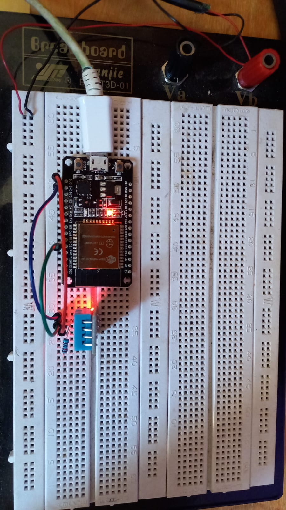
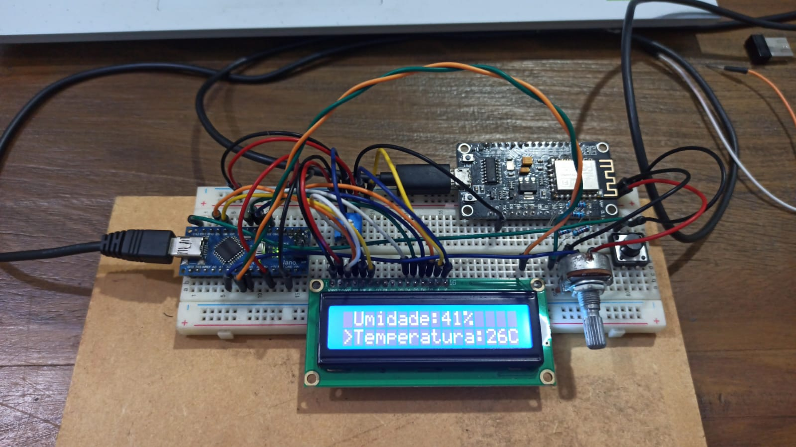

# 📦 UPI - Unidade de Produção Independente


Este trabalho foi desenvolvido pelo trio:
- Emanuella Feital Ferraz
- Lucas Emanuel Lobo Costa
- Warley Fernandes Xavier da Silva


## 🐳 Configuração do Docker

O Docker é usado para garantir que a aplicação Python, que gerencia os registros dos dados nos tópicos MQTT, o Grafana e o banco de dados Postgres rodem em containers. Abaixo estão os comandos para construir e executar os containers:

### 🚀 Construção e Execução Inicial
```bash
docker-compose up --build
```

### ▶️ Execução dos Containers
```bash
docker-compose up
```

## 📊 Grafana

O Grafana, nosso software de visualização de dados, exige configuração manual do dashboard. No diretório `grafana_backups`, o arquivo `arquivo_dash.json` contém queries e parâmetros para configurar o dashboard.

### 🔧 Procedimentos Iniciais

1. Acesse `https://localhost:3000` no seu navegador.
2. Faça login com `user` e `password` ambos como "admin".
3. Configure o banco de dados Postgres no host `postgres:5432`.
4. Crie um novo dashboard e use o conteúdo do arquivo JSON como base. Caso haja problemas nas queries, clique em cada campo SQL, faça uma alteração pequena (como adicionar um espaço) e clique em "executar query" para cada painel com problemas.

## 🗃️ Banco de Dados Postgres

Os dados são armazenados neste banco de dados. Use as seguintes credenciais para acessar o banco através de um software como DBeaver:

```
POSTGRES_USER: admin
POSTGRES_PASSWORD: admin
POSTGRES_EXTERNAL_HOST: localhost
POSTGRES_INTERNAL_HOST: postgres
POSTGRES_PORT: 5432
```

Para conexão externa (fora dos containers Docker), utilize o host externo com o DBeaver. No início da execução da aplicação Python, um script cria as tabelas necessárias. Caso haja problemas, execute o script manualmente usando um software ou um script Python. O script SQL está em `python_app/src/init.sql`.

## 🧪 Testando o Sistema com Sensores Falsos

Você pode testar o sistema publicando dados falsos nos tópicos. Use o código Python abaixo para gerar e publicar dados de umidade e temperatura.

Existem, também, arquivos para simulação no diretório `simulations`.

```python
import paho.mqtt.client as mqtt
import time
import random
import json
from datetime import datetime

# Configurações do MQTT
MQTT_BROKER = 'www.maqiatto.com'
MQTT_PORT = 1883
MQTT_USER = 'lucasl050503@gmail.com'
MQTT_PASSWORD = '123456'

# Função para conexão
def on_connect(client, userdata, flags, rc):
    print("Conectado com sucesso. Código de resultado:", rc)

# Configuração do cliente MQTT
client = mqtt.Client()
client.username_pw_set(MQTT_USER, MQTT_PASSWORD)
client.on_connect = on_connect
client.connect(MQTT_BROKER, MQTT_PORT, 60)
client.loop_start()

try:
    while True:
        moisture = random.randint(0, 100)
        temperature = round(random.uniform(10.0, 40.0), 1)
        timestamp = datetime.utcnow().isoformat()

        moisture_message = json.dumps({"timestamp": timestamp, "value": moisture})
        temperature_message = json.dumps({"timestamp": timestamp, "value": temperature})

        client.publish("lucasl050503@gmail.com/UPI1/moisture", moisture_message)
        print(f"Mensagem publicada no tópico 'moisture': {moisture_message}")

        client.publish("lucasl050503@gmail.com/UPI1/temperature", temperature_message)
        print(f"Mensagem publicada no tópico 'temperature': {temperature_message}")

        time.sleep(1)

except KeyboardInterrupt:
    print("Interrompido pelo usuário")

finally:
    client.loop_stop()
    client.disconnect()
```

Para publicar dados na UPI2, altere o parâmetro dos tópicos para "UPI2".

### 👀 Inscrevendo-se nos Tópicos

Use o código abaixo para inscrever-se nos tópicos e visualizar os dados publicados:

```python
import paho.mqtt.client as mqtt

MQTT_BROKER = 'www.maqiatto.com'
MQTT_PORT = 1883
MQTT_USER = 'lucasl050503@gmail.com'
MQTT_PASSWORD = '123456'

def on_connect(client, userdata, flags, rc):
    print("Conectado com sucesso. Código de resultado:", rc)
    client.subscribe("lucasl050503@gmail.com/UPI1/moisture")
    client.subscribe("lucasl050503@gmail.com/UPI1/temperature")
    client.subscribe("lucasl050503@gmail.com/UPI2/moisture")
    client.subscribe("lucasl050503@gmail.com/UPI2/temperature")

def on_message(client, userdata, msg):
    print(f"Recebido mensagem em {msg.topic}: {msg.payload.decode()}")

client = mqtt.Client()
client.username_pw_set(MQTT_USER, MQTT_PASSWORD)
client.on_connect = on_connect
client.on_message = on_message
client.connect(MQTT_BROKER, MQTT_PORT, 60)
client.loop_forever()
```

## Circuito que representa a UPI 01





## Circuito que representa a UPI 02


